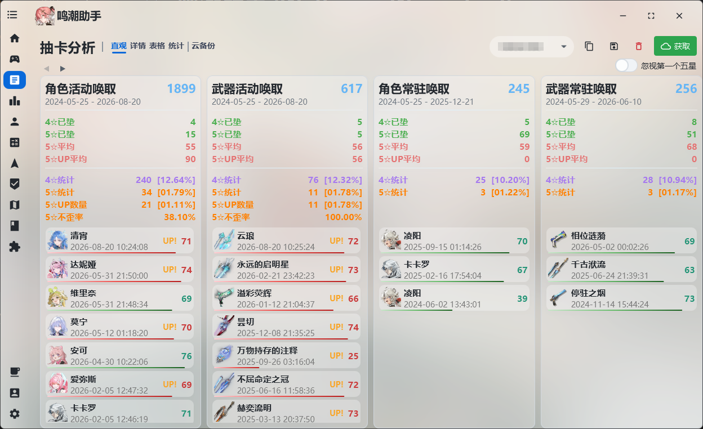
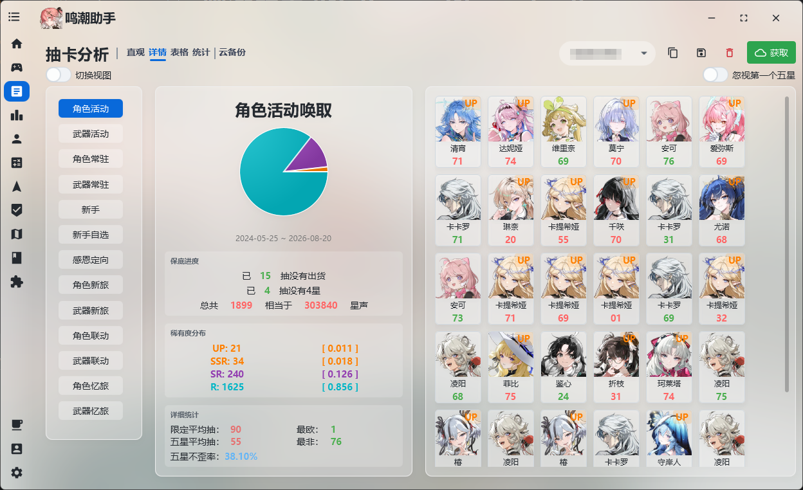
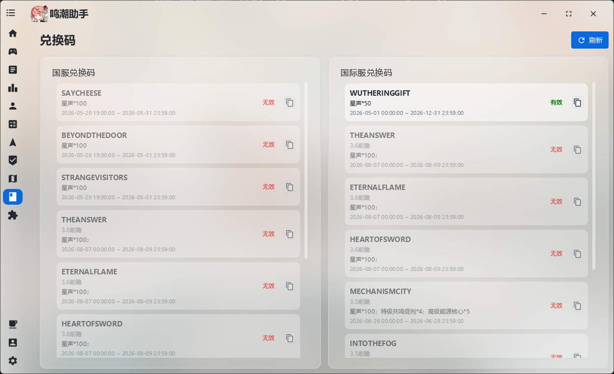

<p align="center">
  
</p>

# 鸣潮助手 (WutheringWavesTool)

[](https://openjdk.org/)
[](https://openjfx.io/)
[](#感谢与支持)
[](https://github.com/leck995/WutheringWavesTool/releases)

> 🌊 鸣潮助手是一款鸣潮的第三方 PC 端工具，可替代原生启动器，同时内置抽卡分析、游戏数据管理、资源更新等多个实用功能，致力于改善鸣潮的游戏体验与数据管理。支持国服与国际服。

## ⬇️ 下载

- 📦 **[点此下载程序](https://github.com/leck995/WutheringWavesTool/releases)**
- 📖 **[点此查看使用教程](https://wave.999758.xyz/)**

## 📋 功能
---

> 助手支持国服与国际服。由于国际服不支持库街区，故国际服功能较少；

| 功能 | 说明 | 国服 | 国际服 |
|:-------|:-----------------------------| :---: | :---: |
| 🎮 启动器 | 替代原生启动器，集成 WIKI、浏览截图等小功能 | ✅ | ✅ |
| 🚀 高级启动 | 一键设置 DX11/DX12、自定义启动参数 | ✅ | ✅ |
| 📂 资源管理 | 游戏资源更新、校验修复、预下载、服务器切换 | ✅ | ✅ |
| 🎲 抽卡分析 | 提供多种抽卡数据视图与统计分析 | ✅ | ✅ |
| ⏱️ 游戏时长统计 | 统计每日游玩时长与总时长（推荐） | ✅ | ✅ |
| ⚔️ 战斗数据统计 | 统计每日战斗数据：战斗次数、声骸获取、闪避次数等（推荐） | ✅ | ✅ |
| 📊 基本游戏数据 | 每日体力、任务电台、各种宝箱数量 | ✅ | ✅ |
| 🎁 兑换码 | 提供国服国际服兑换码及时提醒与查询 | ✅ | ✅ |
| 📅 库街区签到 | 最大支持 9 个账号同时签到，签到物品统计 | ✅ | ❌ |
| 👤 角色查看 | 查看拥有的角色详情：共鸣链、等级、武器、声骸等 | ✅ | ❌ |
| 🧮 养成计算器 | 统计培养角色与武器所需的材料 | ✅ | ❌ |
| 🏛️ 深塔历史数据 | 查看深塔历史数据 | ✅ | ❌ |

## 📸 部分截图

<p>
  
  
  
  
  
  
  
  
</p>

## 🛠️ 构建
---

### 环境要求

- ☕ JDK 25+
- 📦 Maven 3.9+

### 编译运行

```bash
# 克隆仓库
git clone https://github.com/leck995/WutheringWavesTool.git
cd WutheringWavesTool

# 编译
mvn clean compile

# 运行
mvn javafx:run -pl wwt-app
```

## 💬 交流群

🐧 **984939498**

---
## ❤️ 感谢与支持

### 感谢以下开源项目

- [OpenJFX](https://openjfx.io/)
- [ControlsFX](https://github.com/controlsfx/controlsfx)
- [MvvmFX](https://github.com/sialcasa/mvvmFX)
- [JNativeHook](https://github.com/kwhat/jnativehook)
- [Thumbnailator](https://github.com/coobird/thumbnailator)
- [Jackson](https://github.com/FasterXML/jackson)
- [JNA](https://github.com/java-native-access/jna)
- [AtlantaFX](https://github.com/mkpaz/atlantafx)
- [Ikonli](https://github.com/kordamp/ikonli)
- [SQLite JDBC](https://github.com/xerial/sqlite-jdbc)
- [Collapse](https://github.com/CollapseLauncher/Collapse)

🎨 项目背景作者为 [Rafa](https://www.pixiv.net/artworks/120767239)，感谢。

### 赞助

倘若喜欢本程序，欢迎支持一下开发者，您的支持会加快软件的开发进度。

您可以按以下格式留言：`[名称]:[想说的话]`


