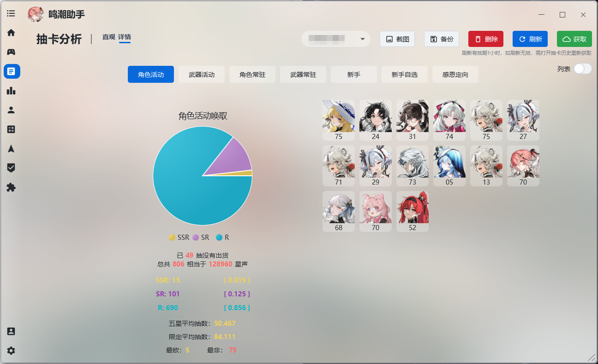
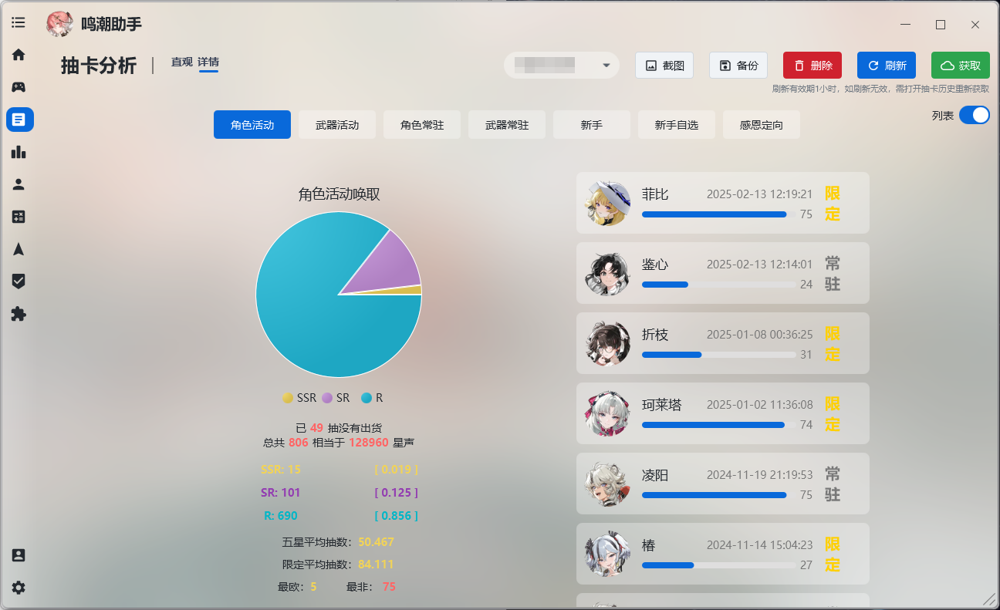
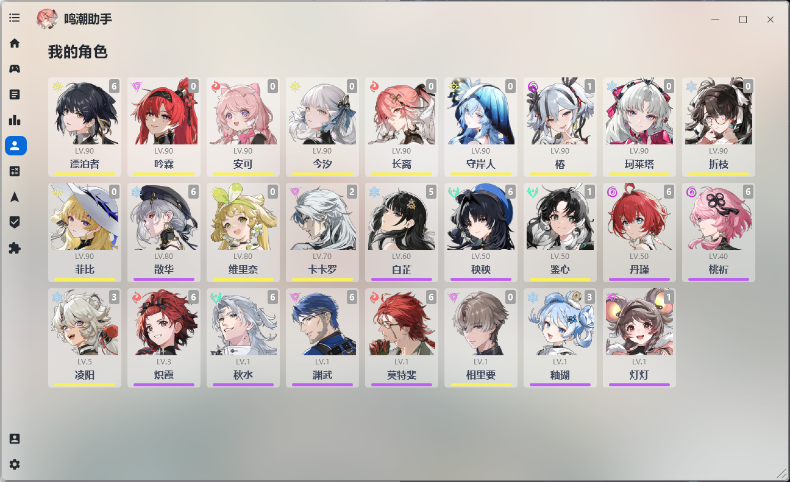
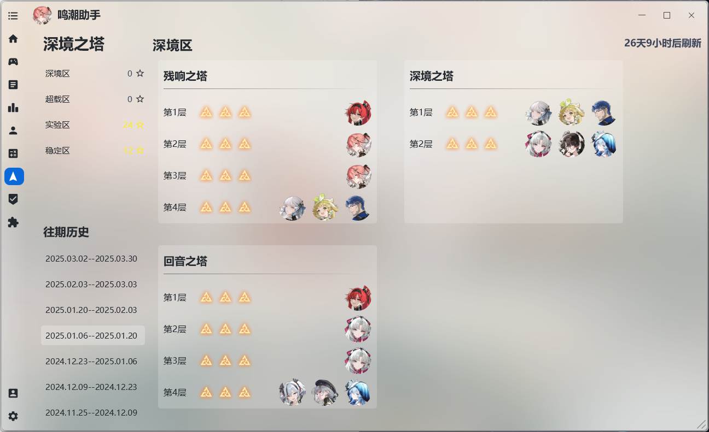
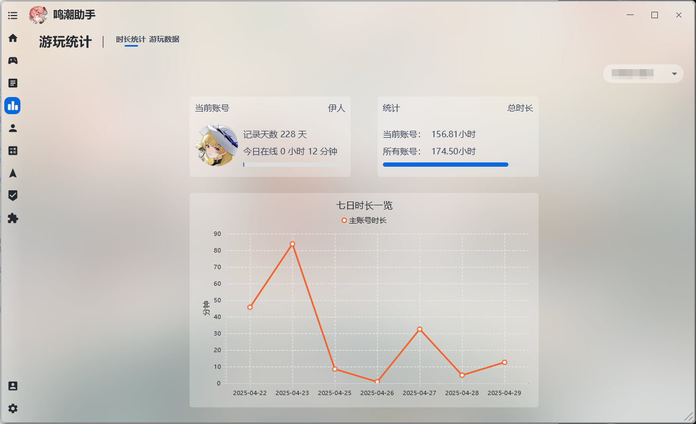

## [中文](https://github.com/leck995/WutheringWavesTool/blob/new-ui/README.md)
***
## 简介
鸣潮助手是一款鸣潮的第三方工具，可替代原生的启动器，同时内置多个有用的小功能，致力于改善PC端鸣潮的游戏体验与游戏数据管理。支持国服，国际服使用。

[点此下载程序](https://github.com/leck995/WutheringWavesTool/releases)

[点此查看使用教程](https://wave.tealc.fun/)

## 功能
___
> 助手支持国服，国际服，由于国际服不支持库街区，故国际服功能少一些；
>
> WEGAME版需要手动转换为官服才能使用全部功能，具体请加Q群（984939498）查看公告获取教程。

1. 替代原生的启动器，集成WIKI，浏览截图等小功能。
2. 高级启动，一键设置DX11和DX12，解锁120帧率（鸣潮2.2后已失效）。
3. 抽卡分析，提供多种抽卡数据视图。
4. 游戏时长统计，只要使用本助手启动鸣潮，即可统计每日游玩时长与总时长。*（推荐)*
5. 游戏数据统计，只要使用本助手启动鸣潮，即可统计每日战斗数据，包括不限于战斗次数，大世界获取的声骸数量，闪避成功次数。*（推荐)*
6. 显示基本游戏数据，包括不限于每日体力，任务电台，各种宝箱数量。*（仅支持国服）*
7. 库街区签到，最大支持9个账号同时签到；签到统计，可以查看签到一共获取了多少物品。*（仅支持国服）*
8. 查看角色，可以查看拥有的角色以及详情，包括共鸣连，等级，武器，声骸等等。*（仅支持国服）*
9. 养成计算器，统计培养每个角色与武器所需的材料*（仅支持国服）*
10. 查看深塔历史数据。*（仅支持国服）*

## 部分截图

## 感谢与支持
***
### 感谢以下开源项目
* [OpenJFX](https://openjfx.io/)
* [Controlsfx](https://github.com/controlsfx/controlsfx)
* [MvvmFX](https://github.com/sialcasa/mvvmFX)
* [Jnativehook](https://github.com/kwhat/jnativehook)
* [Thumbnailator](https://github.com/coobird/thumbnailator)
* [Jackson](https://github.com/FasterXML/jackson)
* [JNA](https://github.com/java-native-access/jna)
* [Atlantafx](https://github.com/mkpaz/atlantafx)
* [Ikonli](https://github.com/kordamp/ikonli)
* [Sqlite-jdbc](https://github.com/xerial/sqlite-jdbc)
* [Collapse](https://github.com/CollapseLauncher/Collapse)

项目背景作者为[Rafa](https://www.pixiv.net/artworks/120767239)，感谢。

### 赞助
倘若喜欢本程序，欢迎支持一下开发者，您的支持会加快软件的开发进度。

您可以按以下格式留言：[名称]:[想说的话]

